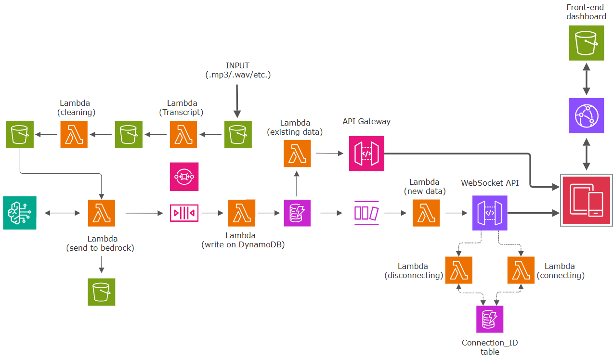

# AI-Powered-Call-Center-Analytics-System-using-AWS-Serverless-Architecture
This repository will hold all information that you need to to view and understand the application architecture
# AI-Powered Call Center Analytics System

A serverless AI-powered call center analytics platform that automatically analyzes customer service conversations using AWS services and Amazon Bedrock.

The system processes call transcripts, performs AI analysis, stores structured insights, and provides a real-time analytics dashboard.

---

# Project Overview

Customer service teams receive a large number of calls every day. Manually reviewing these conversations is time-consuming and inefficient.

This project provides an automated solution that:

* Processes customer call transcripts
* Identifies customer and operator speakers
* Analyzes customer sentiment
* Detects customer issues
* Identifies operator actions and resolutions
* Generates conversation summaries
* Displays analytics through a real-time dashboard

---

# Architecture Overview

The project follows a serverless AWS architecture using event-driven processing.



---

# System Workflow

## 1. Transcript Processing

The call transcript enters the system and goes through multiple processing stages:

```
Call received
        |
        v
     Lambda 1
(create Transcript)
        |
        v
stores it in transcripts/
        |
        v
     Lambda 2
(Clean Transcript Data)
        |
        v
stores it in processed/
        |
        v
     Lambda 3
  sends processed
  to AWS Bedrock
        |
        v
  Amazon Bedrock
  (AI Analysis)
```

---

## 2. AI Analysis

Amazon Bedrock analyzes the conversation using a custom prompt to extract:

* Customer sentiment
* Call type
* Issue category
* Resolution status
* Operator action
* Conversation summary
* Reconstructed conversation

Example output:

```json
{
  "customer_sentiment": "NEGATIVE",
  "customer_call_type": "COMPLAINT",
  "issue_category": "COLD_FOOD",
  "resolved": true,
  "operator_action": "REPLACED_MEAL",
  "summary": "Customer received a cold meal and requested a replacement."
}
```

---

## 3. Message Queue Processing

After AI analysis:

```
Amazon Bedrock
        |
        v
       SQS
        |
        v
     Lambda 4
        |
        v
     DynamoDB
```

Amazon SQS is used to decouple AI processing from database storage and improve reliability.

---

# Real-Time Dashboard Architecture

The dashboard supports both historical data loading and real-time updates.

## Historical Data

When users open the dashboard:

```
Frontend
    |
    v
API Gateway
    |
    v
Lambda get-calls
    |
    v
DynamoDB
```

The API retrieves previous call analytics from DynamoDB.

---

## Real-Time Updates

The system uses WebSocket API for instant updates.

```
DynamoDB
    |
    | DynamoDB Stream
    v
Lambda 6
    |
    v
WebSocket API
    |
    v
Dashboard
```

When a new call analysis is stored, connected users receive the update immediately without refreshing the page.

---

# AWS Services Used

| AWS Service                   | Purpose                                        |
| ----------------------------- | ---------------------------------------------- |
| Amazon S3                     | Hosts frontend static files                    |
| Amazon CloudFront             | Global delivery of frontend application        |
| AWS Certificate Manager (ACM) | HTTPS/TLS certificate management               |
| AWS Lambda                    | Serverless backend processing                  |
| Amazon Bedrock                | AI-powered conversation analysis               |
| Amazon SQS                    | Message queue between services                 |
| Amazon DynamoDB               | Store call analytics and WebSocket connections |
| Amazon API Gateway            | REST API for retrieving historical data        |
| API Gateway WebSocket         | Real-time dashboard communication              |
| DynamoDB Streams              | Trigger real-time processing                   |

---

# Lambda Functions

## Lambda 1 - Start transcript job  

Start transcript job using AWS Transcribe and stores it in transcripts/
---

## Lambda 2 - Transcript Cleaner

Cleans and prepares transcript data before sending it to the AI model.

---

## Lambda 3 - Bedrock Analyzer

Sends the cleaned transcript to Amazon Bedrock with a custom prompt and receives structured analytics.

---

## Lambda 4 - Analytics Storage Processor

Consumes messages from SQS, processes AI output, and stores results in DynamoDB.

---

## Lambda get-calls

Provides historical call analytics through API Gateway.


---

## Lambda 6

Handles DynamoDB Stream events and pushes new call analytics to connected dashboard users through WebSocket API.

---

## WebSocket Connect Lambda

Stores active dashboard connection IDs in DynamoDB.

---

## WebSocket Disconnect Lambda

Removes disconnected users from the connections table.

---

# Frontend

The dashboard is hosted using:

```
S3 Static Website Hosting
          |
          v
CloudFront Distribution
```

The frontend communicates with:

* API Gateway for historical data
* WebSocket API for real-time updates

---

# Key Features

✅ AI-powered call analysis
✅ Sentiment detection
✅ Issue classification
✅ Automatic resolution detection
✅ Real-time dashboard updates
✅ Serverless architecture
✅ Scalable AWS design
✅ Event-driven processing
✅ Front-end with charts easy to understand
---

# Technologies Used

## Cloud

* AWS Lambda
* Amazon S3
* Amazon CloudFront
* Amazon DynamoDB
* Amazon SQS
* Amazon API Gateway
* Amazon Bedrock
* AWS ACM
* AWS CloudWatch

## Development

* Python
* JavaScript
* HTML
* CSS

---

# Security Considerations

* IAM roles are used for AWS service permissions.
* HTTPS is enabled using AWS Certificate Manager.
* No AWS credentials are stored inside application code.

---

# Future Improvements

Possible improvements:

* Add authentication using Amazon Cognito.
* Add CloudWatch dashboards and monitoring.
* Add DynamoDB indexes for optimized queries.
* Add CI/CD deployment pipeline.

---

# Author

Yazan Maswady

Software Engineering Student
Cloud Computing & AI Enthusiast
